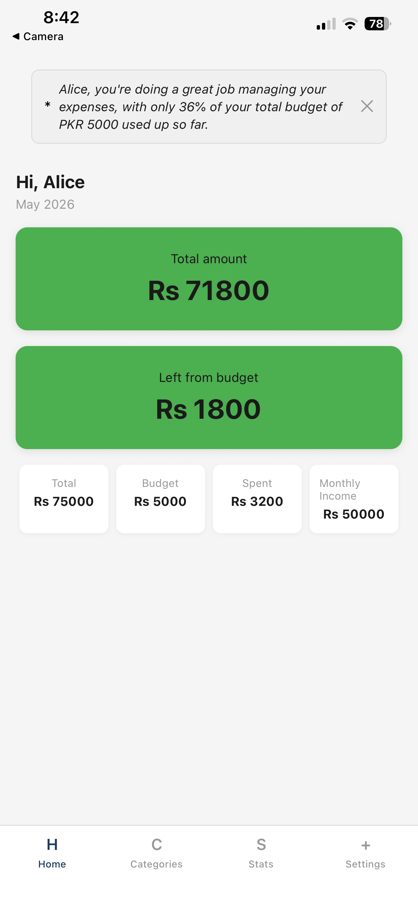
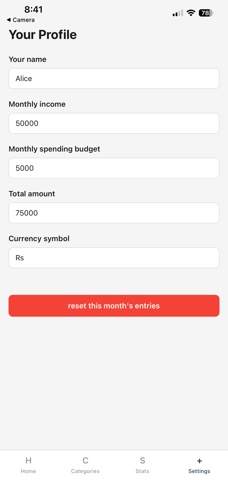
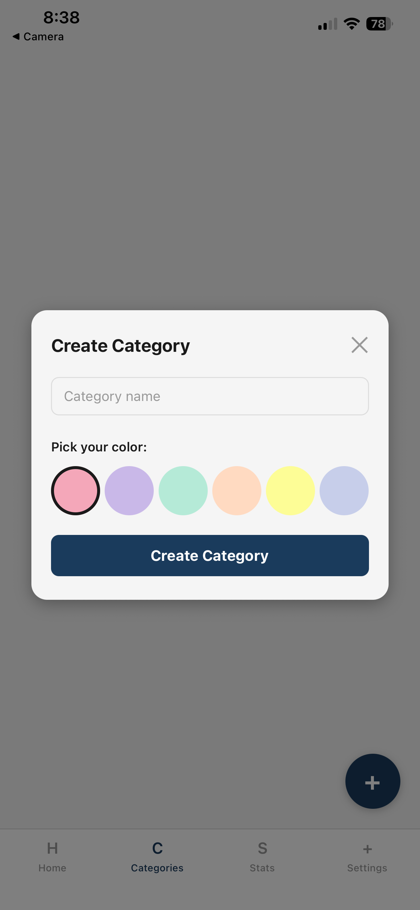
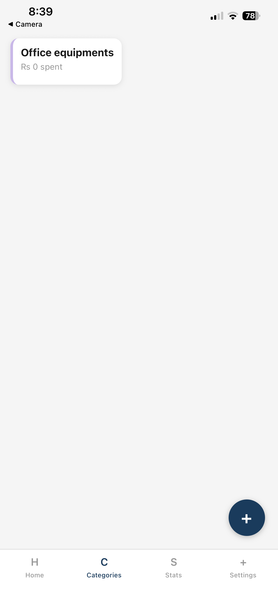
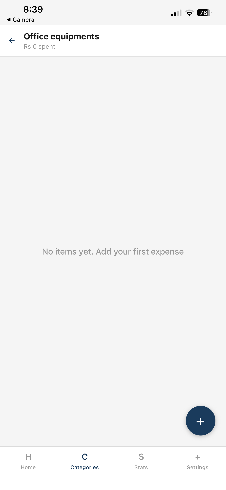
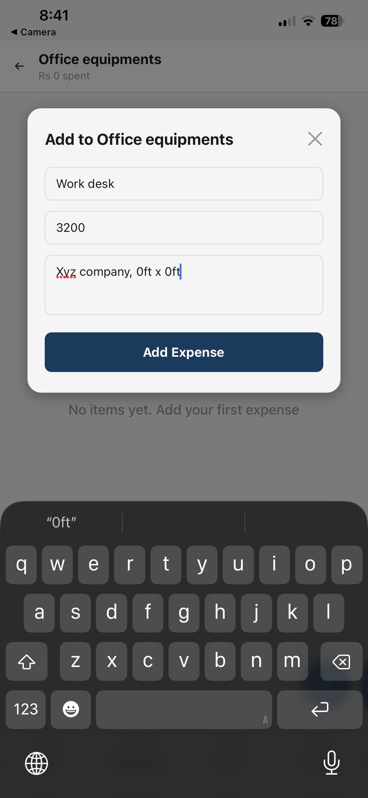
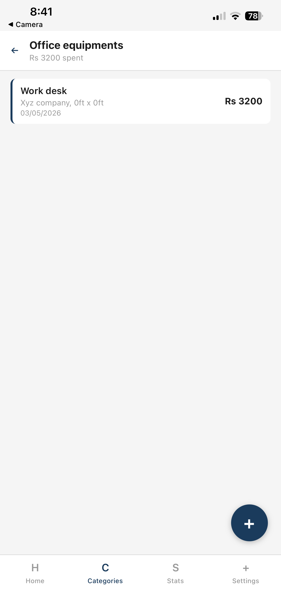
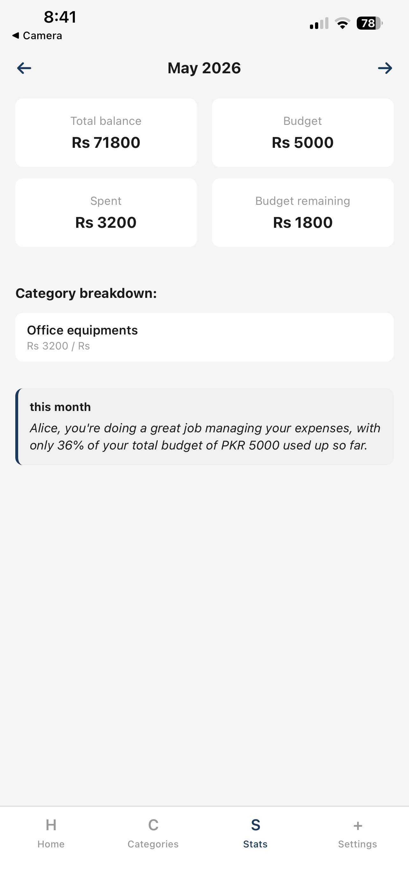

# AI Powered Finance Manager

A React Native mobile app that helps you track expenses, manage budgets, and get AI-powered financial insights to optimize your spending.

## Features

- **Expense Tracking** - Organize expenses into custom categories with monthly tracking
- **Budget Management** - Set monthly spending budgets and track real-time progress
- **Monthly Snapshots** - Automatically saves monthly summaries including spending, budget, and savings
- **AI Insights** - Get personalized spending insights powered by Groq AI
- **Statistics & Trends** - Detailed category breakdown
- **Local Storage** - All data stored securely on your device using AsyncStorage

## Screenshots

<div align="center">

| Home                                                                            | Settings                                                                      | Create Category                                                                     | Category Added                                                                     |
| ------------------------------------------------------------------------------- | ----------------------------------------------------------------------------- | ----------------------------------------------------------------------------------- | ---------------------------------------------------------------------------------- |
|  |  |  |  |

| Empty Category                                                               | Add Expense                                                                     | Expense Added                                                                  | Statistics                                                                      |
| ---------------------------------------------------------------------------- | ------------------------------------------------------------------------------- | ------------------------------------------------------------------------------ | ------------------------------------------------------------------------------- |
|  |  |  |  |

</div>

## Tech Stack

- **React Native** with Expo 54
- **React Navigation** (Bottom Tabs + Stack Navigation)
- **Groq AI** for intelligent insights
- **AsyncStorage** for local data persistence

## Prerequisites

- Node.js (v14 or higher)
- Groq API key (get one at [console.groq.com](https://console.groq.com))

## Getting Started

### 1. Install Dependencies

```bash
npm install
```

### 2. Set Up Environment Variables

Create a `.env` file in the root directory:

```
EXPO_PUBLIC_GROQ_KEY=your_groq_api_key_here
```

### 3. Run the App

**Start development server:**

```bash
npm start
```

Or use Expo directly:

```bash
npx expo start
```

Then:

- Press `a` for Android
- Press `i` for iOS
- Press `w` for Web

**Or run on specific platform:**

```bash
npm run android
npm run ios
npm run web
```

## Project Structure

```
app/
├── screens/          # Main app screens
components/          # Reusable UI components
services/            # API & storage services
navigation/          # Navigation configuration
constants/           # App constants & colors
assets/              # Images and resources
```
